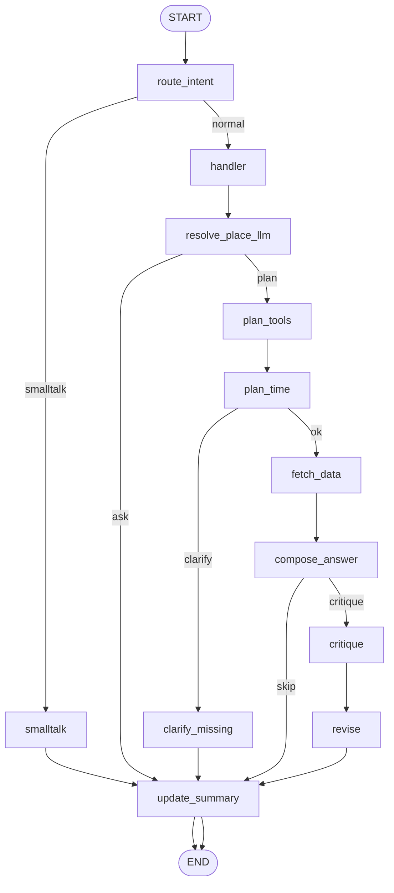
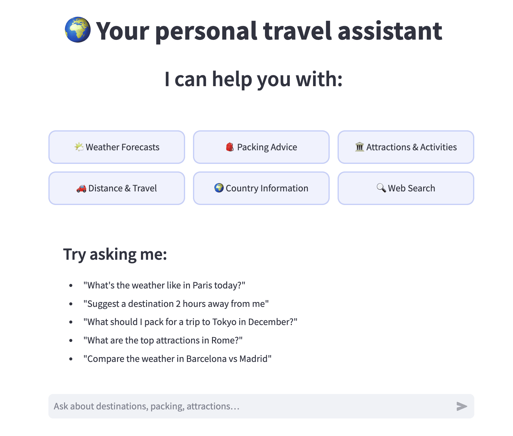
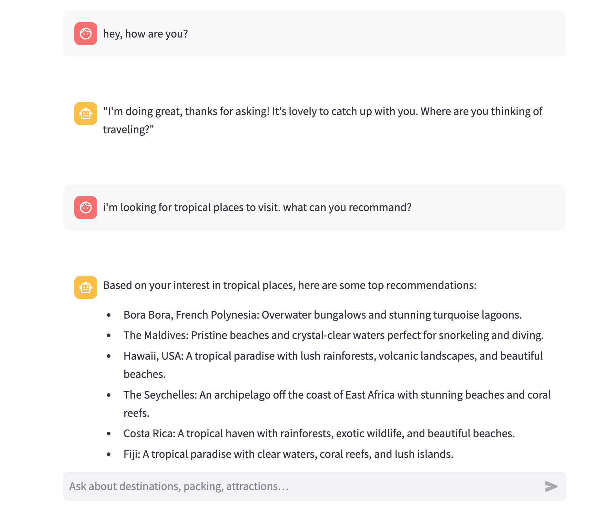
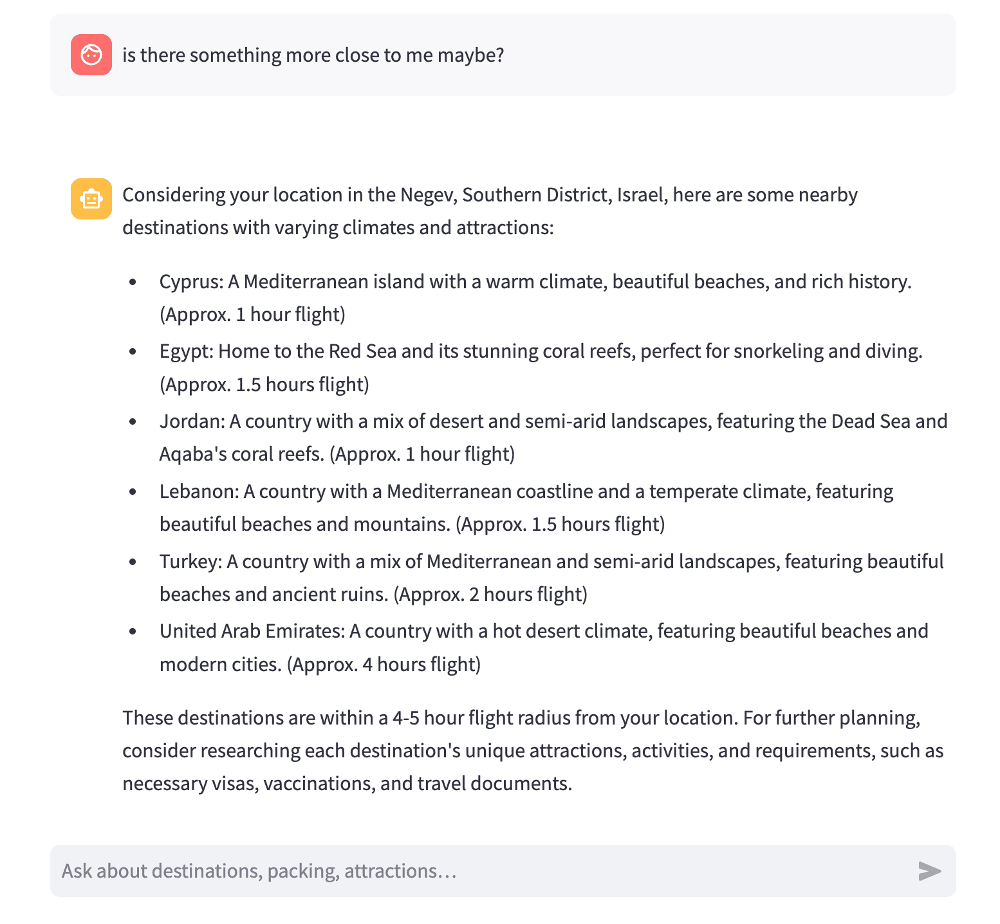
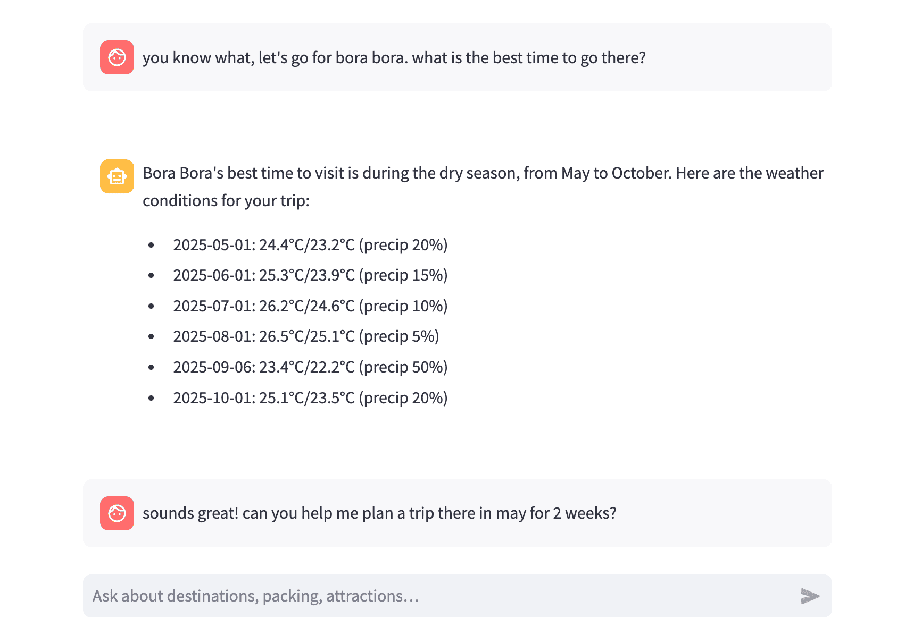
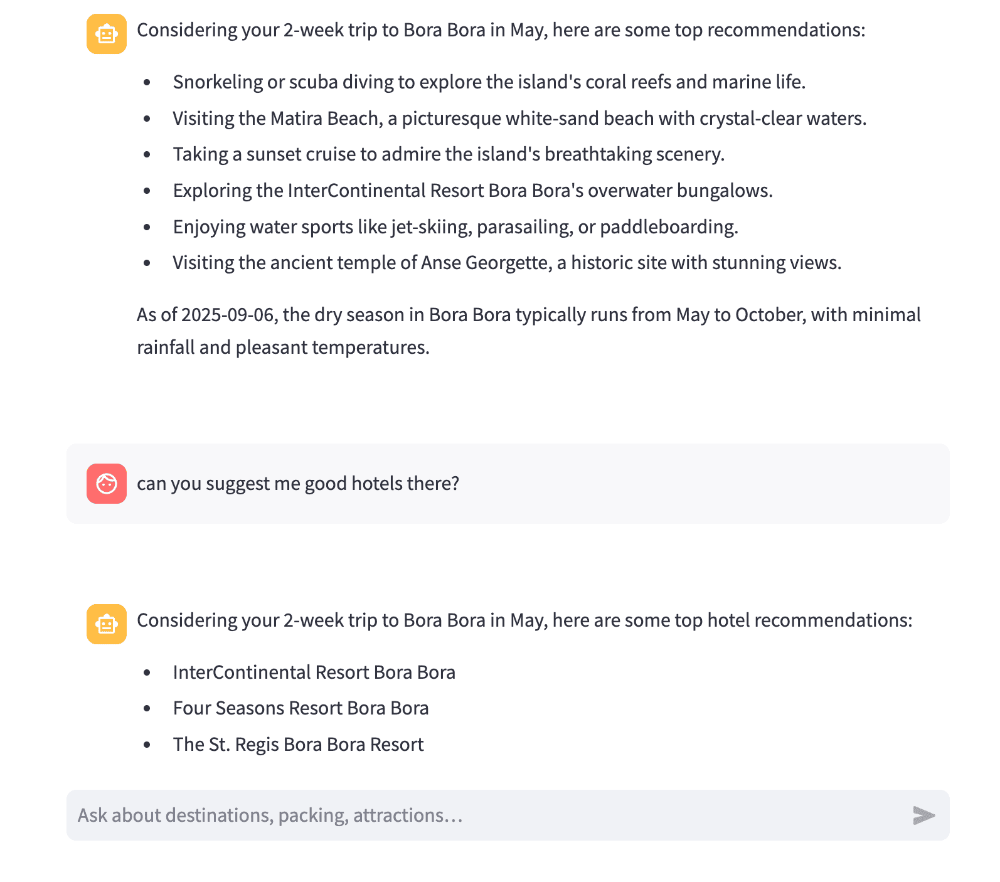
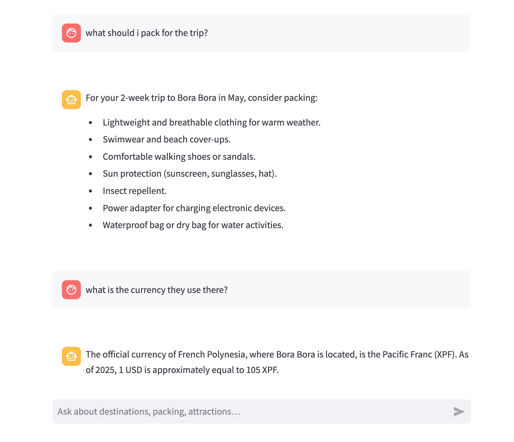

# ✈️ Travel Assistant — LangGraph + Streamlit

An LLM-powered travel assistant built with LangGraph and Streamlit. It plans trips, fetches weather and country facts, and pivots gracefully between smalltalk and task-focused assistance.

> Try it now → [travel-assistant-demo.streamlit.app](https://travel-assistant-demo.streamlit.app/)

## TL;DR

- **Agentic graph** with clear gates ensures reliable, explainable control flow
- **Grounded answers** using live tools: weather, country facts, and search
- **Terse prompting** with strict JSON outputs for deterministic branching
- **Lightweight UI** in Streamlit; one-file boot with minimal setup

## Quick Start

```bash
python -m venv .venv && source .venv/bin/activate
pip install -r requirements.txt
streamlit run app.py
```

## Table of Contents

- [Highlights](#highlights)
- [Architecture Overview](#architecture-overview)
- [Data Flow](#data-flow)
- [Exact LangGraph Flow](#exact-langgraph-flow)
- [State Contract](#state-contract)
- [Tools](#tools)
- [Prompt Engineering Notes (Key Decisions)](#prompt-engineering-notes-key-decisions)
- [Local Development](#local-development)
- [Deployed Demo](#deployed-demo)
- [Screenshots — Sample Conversation](#screenshots--sample-conversation)

### Highlights

- **Agentic flow with gates**: Robust control flow via LangGraph to route intent, clarify missing info, fetch tools, compose answers, optionally critique, and summarize.
- **Tooling**: Weather (Open‑Meteo), country facts, web search (Tavily), time/clock utilities, and reverse geocoding for browser-based location.
- **Careful prompting**: Smalltalk redirection, structured planners with strict JSON, facts-first composition, and critique gating for long/low‑confidence drafts.
- **Streamlit UI**: Lightweight chat interface with simple session persistence and an onboarding welcome screen.

### Architecture Overview

The app is composed of a Streamlit UI front-end and a LangGraph execution backend orchestrating LLM calls and tools.

- `app.py`

  - Streamlit UX, session state, welcome screen, chat loop
  - Browser geolocation via `streamlit_js_eval.get_geolocation()` and reverse geocode through `graph.tools.location.get_client_location_data`
  - Builds and invokes the compiled graph with a `GraphState`

- `graph/`

  - `__init__.py` — graph assembly (nodes + gates + edges) and optional LangSmith tracing
  - `nodes.py` — all node functions: intent routing, handlers, planners, data fetching, composition, critique, revision, and summary
  - `state.py` — `GraphState` TypedDict defining the shared data contract passed between nodes
  - `policies.py` — simple regex heuristics (`hint_*`) used by planners as backstops
  - `prompts.py` — prompt templates and JSON contracts for planners and composer
  - `helpers/` — utilities for destination memory, weekend calculation, deep merge
  - `tools/` — concrete tool integrations: weather, country facts, Tavily search, clock/time utilities, and location reverse‑geocode

- `llm/`
  - `llm_client.py` — LLM client helpers (Groq + LangChain chat wrappers), simple structured JSON callers, LangSmith wiring
  - `langsmith_config.py` — opt‑in tracing helpers

### Data Flow

1. User sends a message in Streamlit → `app.py` normalizes state and calls the compiled graph.
2. The graph routes the message (smalltalk vs. travel) and, for travel, plans which tools are needed.
3. If a blocking slot (e.g., place for weather) is missing, the graph asks a clarifying question.
4. Otherwise, tools fetch facts which are merged into `state.data.facts` for composition.
5. The composer builds a fact-aware answer; long/uncertain drafts may be critiqued and revised.
6. The turn ends by updating a durable summary.

### Exact LangGraph Flow



### State Contract

`graph/state.py` defines `GraphState`, the shared data exchanged between nodes. Selected keys:

- `history`: recent chat messages in the format `{role, content}`
- `user_msg`: the latest user message (normalized)
- `intent`: routed intent label
- `user_profile`: durable slots such as destination and dates
- `data`: planning flags and fetched facts (`facts.weather_by_place`, `facts.country`, `facts.web` …)
- `draft` / `final`: intermediate vs. final assistant text
- `critique_needed` / `critique_notes`: gating and outputs for critique step
- `summary`: compact running summary appended each turn

### Tools

- `graph/tools/weather.py`

  - `geocode(place)` → Open‑Meteo geocoding (place → lat/lon, country code)
  - `forecast_daily(lat, lon, units)` → daily weather forecast

- `graph/tools/location.py`

  - `get_client_location_data(latitude, longitude)` → reverse‑geocode browser coordinates via BigDataCloud
  - Called only when `lat` and `lon` are available from the browser

- `graph/tools/countries.py`

  - `country_facts(name)` → country-level facts (name, capital, currencies, etc.)

- `graph/tools/tavily.py`

  - `web_search(query, max_results)` → Tavily search results (requires API key)

- `graph/tools/clock.py`
  - `now_iso()` and `today(tz)` utilities used for time planning and outputs

### Prompt Engineering Notes (Key Decisions)

- **Strict JSON contracts for planners**

  - The planner (`PLANNER_SYS`), time planner (`TIME_PLANNER_SYS`), and place resolver (`PLACE_RESOLVER_SYS`) return JSON with exact keys and types. This enables deterministic branching in LangGraph and removes fragile parsing.

- **Smalltalk pivot**

  - `SMALLTALK_REDIRECT_PROMPT` produces short replies and then asks one concise question to bring the user back to travel. The router also keeps “short follow‑ups” aligned with prior intent to reduce dead ends.

- **Facts-first composer**

  - `COMPOSE_TMPL` builds the user-facing answer while explicitly injecting available facts and a checklist. A "Strict Facts Policy" prioritizes the fetched data and avoids asking users to consult external sources we already fetched.

- **Critique gating**

  - The composer sets `critique_needed` only when drafts are very long or low‑confidence. This saves tokens and latency while still providing a quality check for verbose answers.

- **Distance & time heuristics**

  - Simple regex policies (`hint_*`) act as backstops when planner signals are weak (e.g., user intent contains "near me" → prefer to fetch or request location context; time-of-day phrases map to today for weather).

- **Location handling**
  - We only call reverse‑geocode when browser coordinates are present. No IP-based geolocation is used.

### Local Development

Requirements: Python 3.11+

```bash
python -m venv .venv && source .venv/bin/activate
pip install -r requirements.txt

# Run the app
streamlit run app.py
```

Environment variables (optional but recommended):

| Variable            | Purpose                                                   |
| ------------------- | --------------------------------------------------------- |
| `GROQ_API_KEY`      | Required for Groq LLM (used by `langchain_groq.ChatGroq`) |
| `GROQ_MODEL`        | Optional model name; defaults to `llama-3.1-8b-instant`   |
| `TAVILY_API_KEY`    | Enables web search via Tavily                             |
| `LANGCHAIN_API_KEY` | Enables LangSmith tracing (if available)                  |
| `LANGCHAIN_PROJECT` | Optional project name for tracing                         |

You can export these in your shell or a `.env` file (if you prefer a loader).

### Deployed Demo

Try it live: [travel-assistant-demo.streamlit.app](https://travel-assistant-demo.streamlit.app/)

### Screenshots — Sample Conversation

<div align="center">
  <figure>
    
  </figure>
  <figure>
    
  </figure>
  <figure>
    
  </figure>
  <figure>
    
  </figure>
  <figure>
    
  </figure>
  <figure>
    
  </figure>
  <figure>
    
  </figure>
</div>
